# **The IDA-PRO**

1. After using a filter and search for DllMain we will see that its address is : **1000D02E**.

    
    ___
2. Using a functions-filter and search for the "gethostbyname" import will leads us to its location in **"100163CC"**.

    
    ___
3.  By using the Xref graph view we will see that the "gethostbyname" import is called **5-times**.

     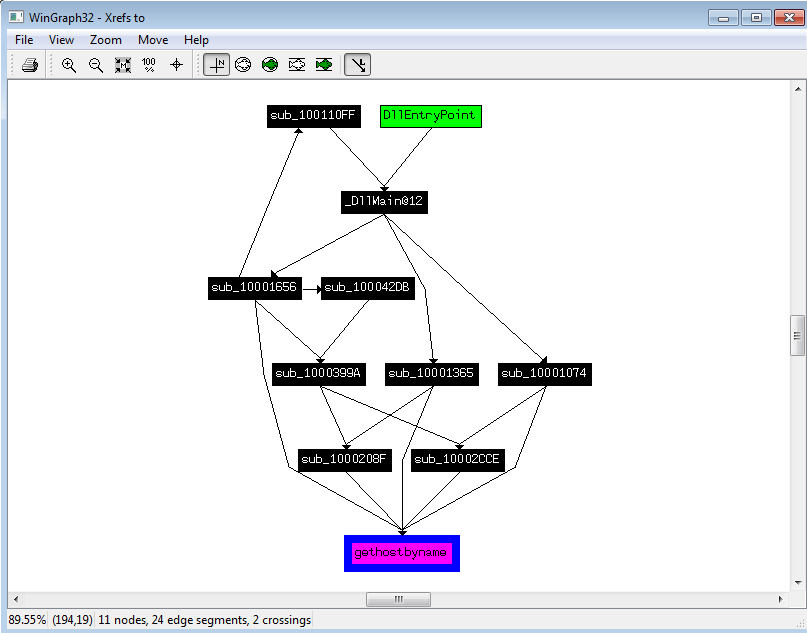
    ___
4. By jumping to 0x10001757 we will see the instruction:
 mov     eax,   off_10019040 
Along with an IDA-PRO comment says :
"[This is RDO]pics.praticalmalwareanalys" which is the value stored in eax (the parameter of our function)
So the requested DNS is: **pics.practicalmalwareanalysis.com**.

    
    ___
5. By using pseudocode view we wil see that there are **23** local variable ( the ones with negative offsets).

    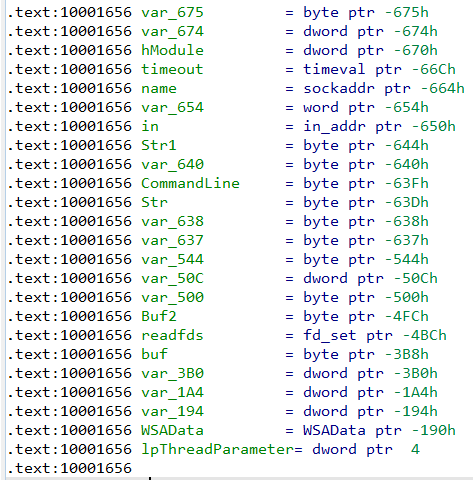
    ___

6. Only **one**  that IDA Pro has recognized, It has been named to **"lpThreadParameter"**

    
    ___
7. After using a string filter for the string contains "\cmd.exe /c", by
double clicking it we will find it at **"10095B34"**.

    
    ___
8. 
    - Now we see that some values are pushed into the stack that catch out eyes like "quit", "exit", "minstall" and "inject".
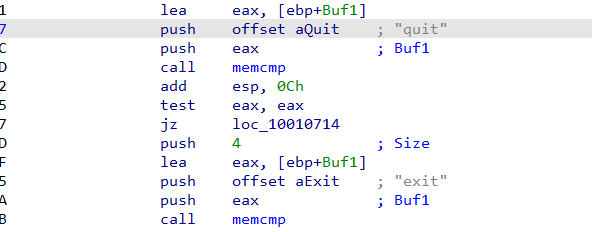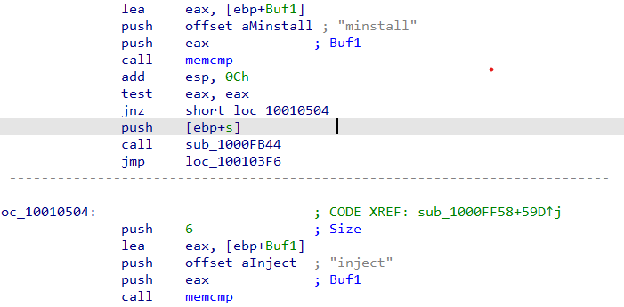
    - Scrolling down more, we an array say "Encrypt magic for this Remote Shell Session".
    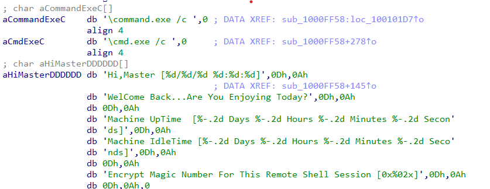
    - I don't know what is happening here for certain, best guess will be that this is a remote shell session.
    ___
9. 
    * The "dword_1008E5C4" is in .data  section, So using Xref we will see 2 functions read its data and only one writes it
     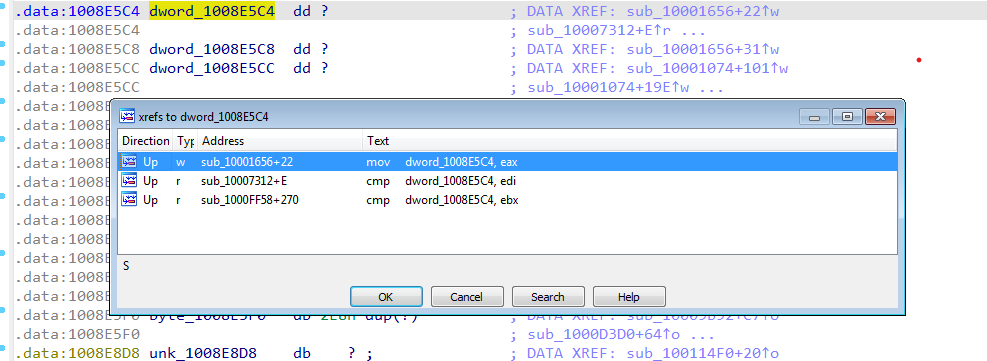

   *  By double clicking on it, we notice that the "dword_1008E5C4" stores what is in EAX which is the returning value of calling sub_10003695
    

    * By gitting into sub_10003695 we will see a call to "GetVersionExA" function which is responsible for gathering some information about the OS version (Read more from [here](https://learn.microsoft.com/en-us/windows/win32/api/winnt/ns-winnt-osversioninfoa))
    and compare it with "2" later in "0x100036B7"
        

    *So in breif :*  
            the dword_1008E5C4 stores **the OS version.**
    ___
10. * As we see, if the string comparison to robotwork is successful (when memcmp returns 0) the The jnz at will not be taken and the call to "sub_100052A2" will occure,
        

    * By going to "sub_100052A2" we will see that it gather some information about "SOFTWARE\Microsoft\Windows\CurrentVersion"
         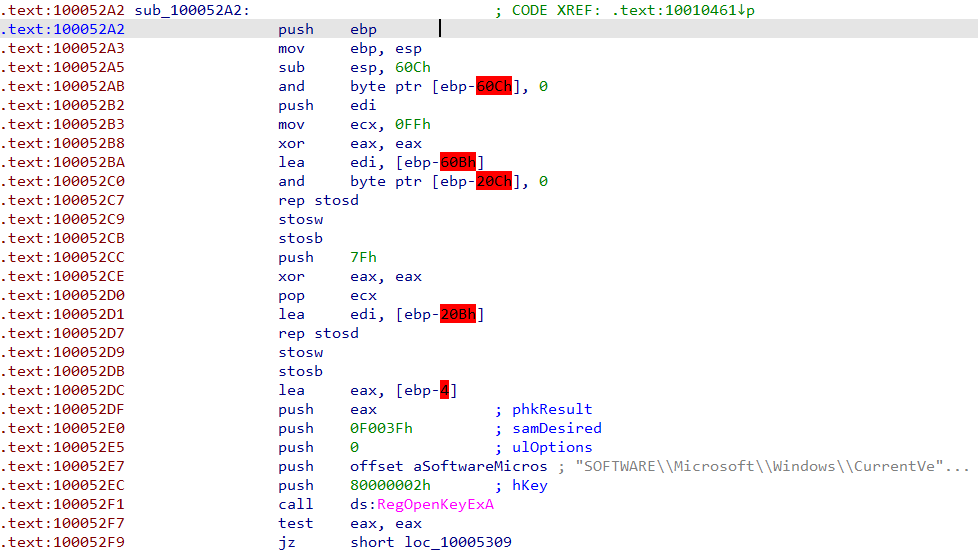
    ___

11. * After finding PSLIST and by using the graphical view we will see that there is to ways the execution my follow depending on te result of calling "sub_100036C3"

    *  The "sub_100036C3" looks like it gathetr some information about "OS version".

    *  Both ways will lead us to "loc_1000705B" which sent out these information via network socket.
    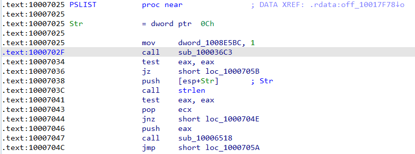
    ___
12. Using Xref from "sub_10004E79", we will see that it uses " GetSystemDefaultLangID", "sprintf", "strlen", so I would name it "_get_language_ID" 
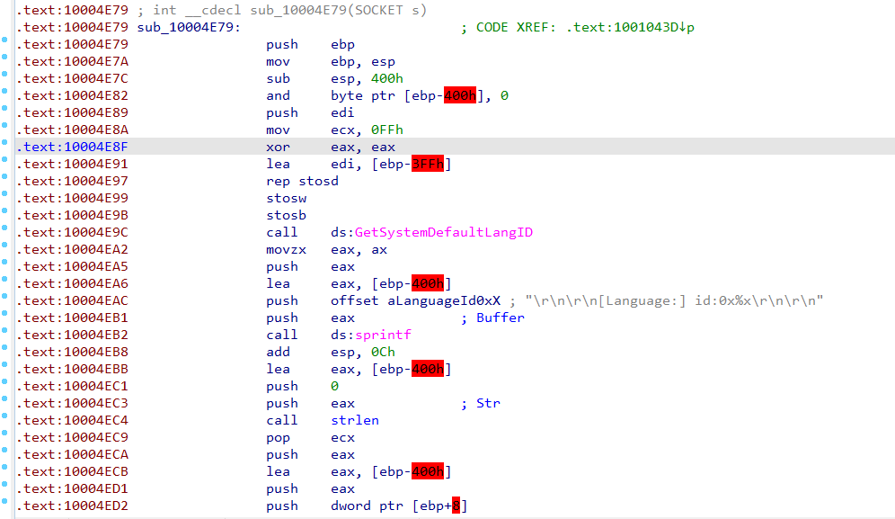
    ___

13. Using a custom cross-reference graph 
for "0x1000D02E", we will see that there is 4 functions called directly by "_DllMain@12".

    ___
14. The sleep function takes eax as it's parameter, by going back in code we find that:
    * eax stores the string "[This is CTI]30".
    * by adding "0D" the pointer moves by 13 offsets leaving only '30' in eax
    * calling atoi is just a method to convert string-type to int-type.
    * At last the '30' is multiplied by '1000' and stored in eax
    * finally eax is passed to "Sleep", So the program will sleep by 30,000 milli_second (30 second).

    
    
    ___
15. Looking at this address we can see a call to socket which takes 3 parameters (protocol, type, and af) all of which are pushed to the stack prior to the call

    
    ___
16. By going to the [MSDN Socket Function](https://learn.microsoft.com/en-us/windows/win32/api/winsock2/nf-winsock2-socket) we will be able to see the meaning of each parameter :

    
    | parameters | symbolic_constants | meaning |
    | :--- | :--- | :--- |
    | 2 | AF_INET | The Internet Protocol version 4 (IPv4) address family.|
    | 1 | SOCK_STREAM | A socket type that provides sequenced, reliable, two-way, connection-based byte streams with an OOB data transmission mechanism. This socket type uses the Transmission Control Protocol (TCP) for the Internet address family (AF_INET or AF_INET6). 
    | 6 |  IPPROTO_TCP| The Transmission Control Protocol (TCP). This is a possible value when the af parameter is AF_INET or AF_INET6 and the type parameter is SOCK_STREAM.|
    ---
17. * By searching for "ED" as a sequance of bytes we can see that it's in use with the string "VMXh" in "sub_10006196"
    * Usin an "Xref to" graph for sub_10006196 will tell us that this function had been called 3-times by "InstallSB", "InstallSA" and "InstallRT".
    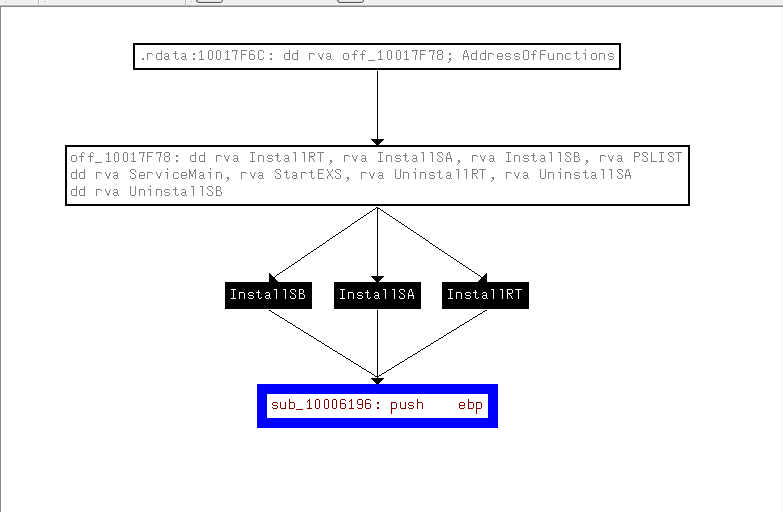
    * By diving into each one of them we will found a comparsion that decide if th VMWare is deticted go to "loc_1000D870" then cancel the installaion, if not go to "loc_1000D88E" and continue.
    
    ---
18. By going to "0x1001D988" all we can see is a collection of random data.
 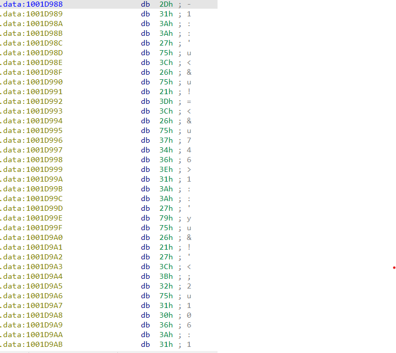
    ___
19. By runing the py_Script we will see that these random data are changing, but still random.
    ___
20. By pressing (A key) we can combine the whole string in ASCII form, now we can see this random text before applying the script :
    > -1::'u<&u!=<&u746>1::'yu&!'<;2u106:101u3:'u%'46!<649u849"4'0u4;49,&<&u47uo|dgfa
    >
    turns into that readable text after applying it :
    >xdoor is this backdoor, string decoded for practical malware analysis ab :)1234
    >
    ___
21. By opining the script in VScode we see 
Now we understand what happend:

    * The variable "sea" stores the location of the curser which is our start address.
    * The for loop is set to excute it's internal instructions for the next (50) memory address.
    * The internal instructions of the for loop are to preformed an (XOR) operation for every time the loop happened.
    * The overview of the code is that it does an (XOR) operation for our random (50) data which will turn them too more human readable data.

___
___