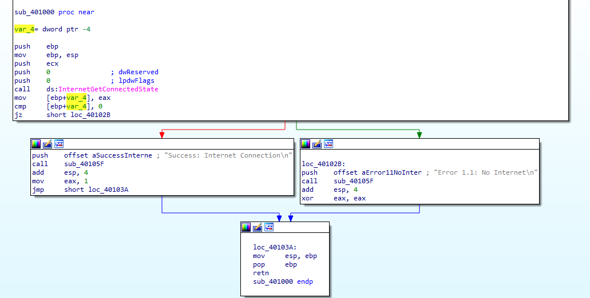
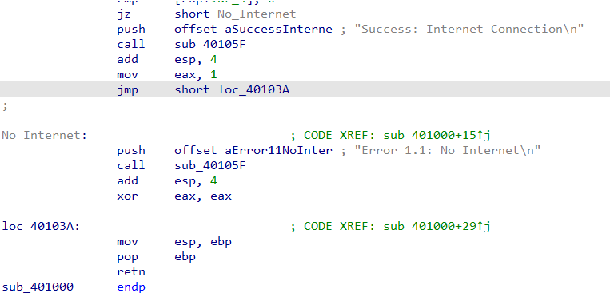
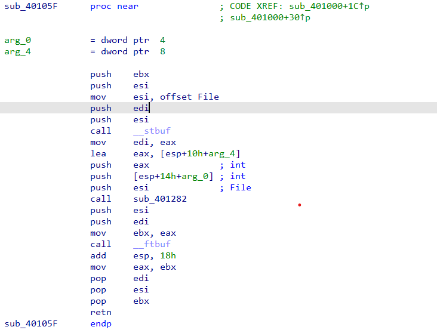
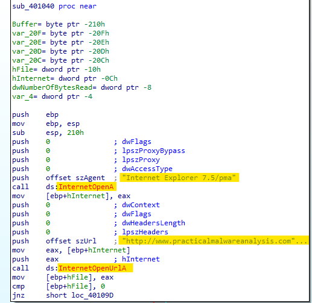
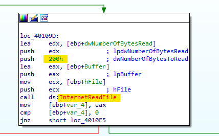
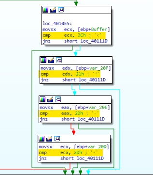
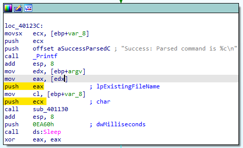
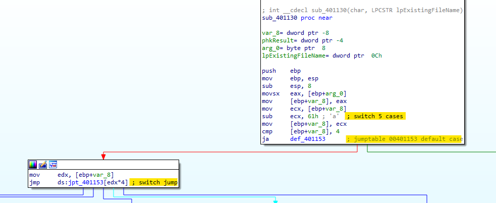
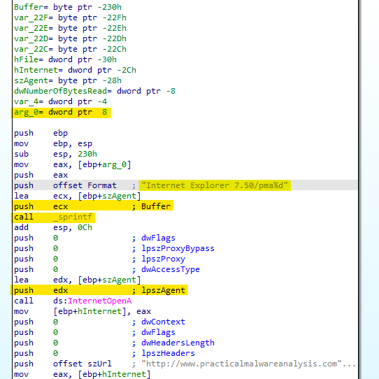

# **RECOGNIZING C CODE CONSTRUCTS IN ASSEMBLY**
## **Lab 6-1 :**
1. By looking to the graphic view we will see that there is comparison that decide which location to jump to, So typicallyit an **IF-Statement** that decides if the internet is connected or not. 

    

    ___
2. - Before the function is called, we see some strings are pushed onto the stack, those strings are end with "\n" a "string buffer".

    - Next we see that "sub_40105F" is calling two function identified as "__stubf" and "__ftbuf"
    

    - Typical to [The .NET Core, internal.h](https://github.com/dotnet/coreclr/blob/master/src/pal/src/safecrt/internal.h#L274-L275) "__stbuf" and "__ftbuf" are "string buffer" and "format buffer" in order which provides support for input/output of files.

    - Now we see that the "sub_40105F" is a **"Printf"**
 function that IDA wasn't able to identify.
    ___
3. Now we can tell that this function searchs for the status of the internet and prints it along with a return value (1) if connected (0) if not".

___
___
## **Lab 6-2 :**

1. The first function is the same functions mentioned in "Lab 6-1" which was an  **IF-Statement** that decides if the internet is connected or not. 
    ___
2. This function was also mentioned in "Lab 6-1" which was a **"Printf"**
 function that IDA wasn't able to identify.
    ___
3. * Fisrt, we see "InternetOpenA" and "InternetOpenUrlA" functions which are used to open an "Internet Explorer" connection and navigate to the "http://www.practicalmalwareanalysis.com/cc.htm" HTML page.

         

    * After that, a comparison occures to test if that connection happened. Then, we see a call to "InternetReadFile" that will be used to read a 200 Bytes from the HTML page.
    
        

    * Again,  a comparison occures to test if that command has been executed if so, it will test if a sequence of characters are equals to "3C", "21", "20" and "20" which in ASCII are "<!--" ,  this format is the comment format in HTML.

        

4. The main constructs in this code are "IF" statments to check the execution of commands and an "Array of characters" to store the bytes of the comment in the HTML page.

5. There are two-network indicators:

    * The program uses the HTTP User-Agent Internet Explorer 7.5/pma.
    * The program downloads the web page located at: http://www.practicalmalwareanalysis.com/cc.htm.

6. The main purpose of the program is to search if the intrnet connection is set or not, If it is, it will open Internet Explorer and download an HTML-Web page and search for a certain character stored in the page as a comment and execute this command character and print "Success: Parsed command is @", were @ is the command, If successful, the program will sleep for 1 minute and then terminate.

___
___
## **Lab 6-3 :**
1. The new called function is  "sub_401130" which was in the "Lab06-02.exe".
    ___

2. There are 2 parameters being pushed onto the stack:
    *  The first is a long pointer to the argv ( arg[0] which is a reference to a string containing the current program's name.)
    * The second is a char which contain the value in EAX ( the returning value from "sub_401040".) 

    
    ___

3. IDA-PRO has already identified the main construct as a **Switch case** statment with a jump table technic. 
 
    ___

4. The switch statment can do 6 options depende on the case, The options are :
    * Create the path " C:\\Temp" if it doesn't already exist. 
    * Copy the file "Lab06-03.exe" to "C:\Temp\cc.exe."
    * Delete the file "C:\Temp\cc.exe" if it exists.
    * Set a value in the Windows registry found in "Software\Microsoft\Windows\CurrentVersion\Run\" under the name of "Malware" to make the "C:\Temp\cc.exe." start at system boot, (gainig persistence)
    * Sleep for 100 seconds. 
    * Print "Error 3.2: Not a valid command provided."

    
    ___

5.  Coping the program to "C:\Temp\cc.ex" and seting it as a "start at system boot" process are considerable host-based indicators.
    ___

6. The main purpose of the program is to search if the intrnet connection is set or not, If it is, it will open Internet Explorer and download an HTML-Web page and search for a certain character stored in the page as a comment, The character will be tested in Switch statment to determine what action will be taken, All options are a guarantee that the program will start at system boot, Finally it prints "Success: Parsed command is @", were @ is the command, If it all done, the program will sleep for 1 minute and then terminate.

___
___

## **Lab 6-4 :**

1. We can see that there is nothing changed in the functions called by the main method.
    ___

2. We see a **Loop-Statement** has been added, "var_c" is the counter for this loop which was intialized to 0 and incremented by 1 every cycle untill it reatches 1440 "24 hours", it will break.
 
    ___

3.  * The new "sub_401040" now takes argument which is the counter of the loop.
    * A new variable "szAgent" has been created and populated with the formatted User-Agent "Internet Explorer 7.50/pma%d."
    * After that, we see "Sprintf" is being called, which creates the string and stores it in the destination buffer.
    * This means that every time the counter increases, the User-Agent will change.

        
    ___

4. Assuming that the Internet is connected, the loop will be taken the 1440 cycle and sleep 60000 milisecond (1-minute) after each cylce, So this program will terminate after 1440 minute **(Typically 24 hours).**
    ___

5. There are two-network indicators:

    * The program uses the HTTP User-Agent Internet Explorer 7.5/pma%d, , where %d is the number of minutes the program has been running.
    * The program downloads the web page located at: http://www.practicalmalwareanalysis.com/cc.htm.
    ___

6. The main purpose of the program is to search if the intrnet connection is set or not, If it is, it will open Internet Explorer and download an HTML-Web page and search for a certain character stored in the page as a comment, The character will be tested in Switch statment to determine what action will be taken, All options are a guarantee that the program will start at system boot, Finally it prints "Success: Parsed command is @", were @ is the command, If it all done, the program will sleep for 1 minute, then repeat, After a full 24-hours of repreating the program will terminate.

___