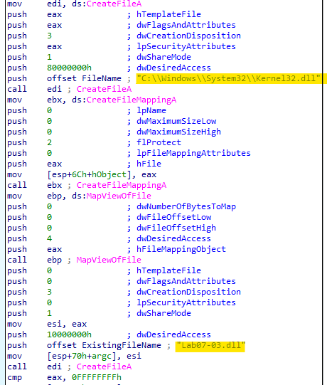
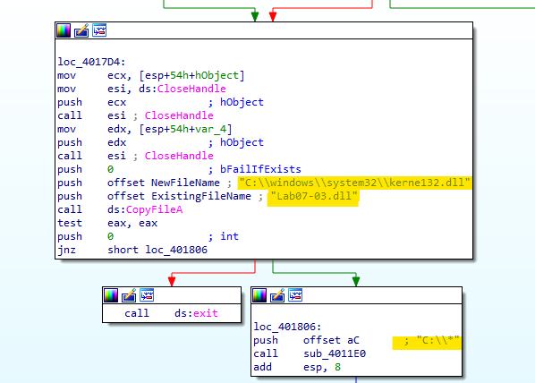
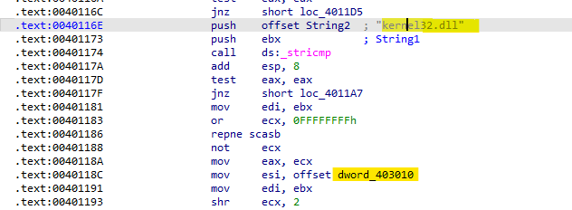
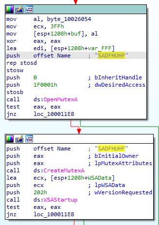

# **Windows Internals**

## **Lab 7-1 :**

1. * By checking the main function using "IDA-PRO", we see that a hint
says "MalService" then a call to "StartServiceCtrIDispatcherA" function.
    

    * By getting into the sub_401040 we see evidence of creating a service.
    
    * According to the MSDN page the "StartServiceCtrIDispatcherA" actually connects the main thread of a service process to the service control manager, which causes the thread to be the service control dispatcher thread for the calling process, Now we know for sur it creates a service.
     ___
2. * We continue to see that it calls OpenMutexA to open a mutex called **"HGL345"** then tests the returning value.

    * depending on the result of the test, the program will either terminate or jump to loc_401064 which will create a mutex under the name of **"HGL345."**
    * This technic is used to make sure that there is only one piece of the malware runing on the machine.
    ___

3. The best way to detecte that malware is bt searching for a mutex named **"HGL345"** or a service named **"MalService."**
    ___

4. Now we see that it uses the "user-agent Internet Explorer 8.0" to get access to the url "http://www.malwareanalysisbook.com" which represent a network-based indicator.

    ___

5. The purpose of this program could be obtained from the next
    * At loc_401064 we can see that the malware is setting a timer to "834h" which is "2100" in decimal.

        
    
    * Next malware is set to sleep untill the year of 2100 comes.
    
    * When that year comes, an infinte loop will start sending requests to the url "http://www.malwareanalysisbook.com" as a distributed denial-of-service (DDoS) attack.
    
    ___

6. This program will never terminate as it is uncodditional jump "INFINITE LOOP".

___

## **Lab 7-2 :**

1. While examining the program we found no evidence of achieving persistence, there is no creation for any scheduled tasks, services, startup files, or run keys.
    ___

2.  * By diging into the program we can see a "OleInitialize" and "CoCreateInstance" functions which are used to initialize a COM object and set its defalut values to a specified CLSID.
    * Then, we see a call to "VariantInit" function to intialize a string to "http://www.malwareanalysisbook.com/ad.html" 
    * Then it excutes that string with the created COM object (likely Internet Explorer).
    * The program will free this string lately after excutes it.
    * **In total**, this program is creating a COM object and uses it to open a URL that may be an advertisement as it ends with "ad.html" (We can make sure of that by running the program).
    ___
3. The program will finish excution whe the ad already appears.
___
## **Lab 7-3 :**

1.  By looking to the program we can't see any obvious proof of persistance, but there is alot of suspicious things within the file  that could be described as next : 
    * First, we see a reference to the supplied DLL "Lab07-03.dll" and the windows DLL "Kernel32.dll."

         
    * Second, we see reference to pushing a close-label but different dll under the name of "kerne132.dll." and the supplied dll "Lab07-03.dll" onto path "C:\\windows\\system32"

        
    * Then, we see a call to "sub_4011E0" which is doing a search for every file in the "C:\\*" directory.
    
    * Now we can see alot of chaos like jumps and comparisions, but that's not our concern right now.
    * By continue searching, we can see a comparison occurs that checks if a file is a .exe and if it is, it calls the "sub_4010A0".
    
    * In "sub_4010A0" we see a call to 3 functions **"CreateFile", "CreateFileMapping"**, and **"MapViewOfFile"**, these fuctions are typically used to map a file to memory and modify it.
    
    
     * After mapping the file into memory, we see a comparison between "kernel32" and a loction in the exe file, if it's found it copies a value referenced by "dword_403010" over the top of it.
      

      * the value stored in the "dword_403010" is "6E72656Bh", by converting it to an ASCII string we see it's actual value.
      

**In brief**, this program searches for all .exe files within C Directory, when an exe is found, it loads it into memory and replace the kernel32.dll with kerne132.dll, this is the way it gains persistance.

___

2. The best two host-base indecators are :
    * The first is writing the DLL " kerne132.dll" to "C:\Windows\System32" and modifying every .exe file on the system to import that DLL instead of the original one "kernel32.dll as we described previously.    
        (*Note, it uses number 1 instead of letter L*).
    * We can the second on inside the "Lab07-03.dll", a creation of mutex under the name of "SADFHUHF".

         
    ___

3.  * According to Q1, this is an advenced back-door that makes a remote access connection.
    * By analyzing Lab07-03.dll, we can see the connection is set with IP **127.26.152.13**
    * the prgram has a lopp to choose between two cammands, either sleep or exectue.
    ___
4. * To remove this malware you can write a script or a program to undo all changes to the executables.
    * Another handy and tricky way is to just delete the "kerne132,dll" and  rename the windows "kernel32.dll" to the deleted one.  
        **Be Carefule** while doing that, because the system may crash during booting due to no variant of kernel32.dll being present.
___
___